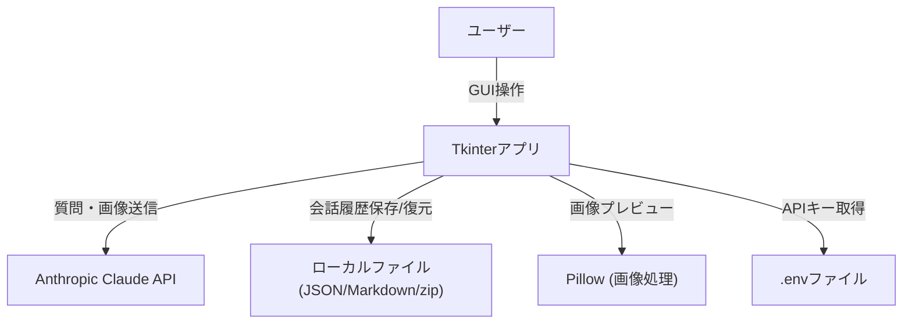

# Claude Chat Desktop App 設計書

## 1. 構成図

## 2. 機能一覧

| バージョン | テキスト質問 | 画像添付 | 会話履歴 | 履歴保存 | 履歴再開（復元） |
|:---|:---:|:---:|:---:|:---:|:---:|
| claude_tk_app_simple.py | ○ | × | × | ○ | × |
| claude_tk_app_image.py | ○ | ○ | × | ○ | × |
| claude_tk_app_multi.py | ○ | × | ○ | ○ | ○ |
| claude_tk_app_multi_image.py | ○ | ○ | ○ | ○ | ○ |

### 共通機能
- Anthropic Claude APIとの連携（APIキーは.envから取得）
- Markdown形式の回答をプレーンテキストに自動変換
- Ctrl+Enterで質問送信
- エラー時のダイアログ表示（APIキー未設定、通信エラー等）
- 質問・回答ペアの履歴をMarkdown/JSON/両方で保存可能（simple/image版は直近1ペアのみ）

### バージョン別機能
- **シンプル版**: テキストチャットのみ。履歴保存時はダイアログで形式選択。
- **画像対応版**: 画像添付・プレビュー・画像付き質問。履歴保存時は画像は保存対象外。
- **マルチターン版**: 会話履歴の保持・保存・再開。
- **マルチターン＋画像対応版**: 画像付き会話履歴の保存・復元（zip形式）。

## 3. 画面構成（例: 画像対応版）

- 左: 画像選択・プレビュー・質問入力欄
- 右: 回答表示欄
- 下部: 「質問を送信」「新しい質問をする」「終了」ボタン

## 4. 主な処理フロー

### 質問送信時
1. ユーザーが質問（＋画像）を入力
2. [送信]ボタンまたはCtrl+Enterで送信
3. APIキーを.envから取得し、Anthropic APIへリクエスト
4. Claudeからの回答を受信
5. Markdown→テキスト変換し、画面に表示
6. 必要に応じて履歴保存用にペアを保持

### 新しい質問/終了時
1. 「新しい質問」または「終了」ボタン押下時、未保存の質問・回答があれば保存ダイアログ表示
2. 保存形式（Markdown/JSON/両方）を選択し、ファイル保存
3. 入力欄・回答欄・画像プレビューをリセット（新規時）またはアプリ終了

### 画像選択・プレビュー
- 画像選択時、Pillowで最大200x200pxにサムネイル化しプレビュー表示
- 画像はbase64エンコードでAPI送信
- 画像削除ボタンで選択解除

## 5. 保存データの構造

### Markdown/JSON形式（simple/image版）
- 直近の質問・回答ペアを保存
- 画像対応版は画像自体は保存対象外

### マルチターン/画像マルチターン版
- 会話履歴をJSON/Markdownで保存
- 画像付きはimg/配下に画像を保存し、zipでまとめる

## 6. 依存パッケージ
- anthropic
- python-dotenv
- markdown
- Pillow

## 7. 注意事項
- APIキーは.envファイルで管理
- インターネット接続必須
- 画像はbase64エンコードでAPI送信
- zip復元時は一時ディレクトリを利用
- Markdownの表や複雑なコードは正しく変換されない場合あり
- simple/image版は「新しい質問」「終了」時に未保存ペアがあれば保存ダイアログが表示される

- **claude_tk_app_simple.py**: 質問・回答ペアの履歴を保存（JSON/Markdown）は可能ですが、保存した履歴の再開（インポート）はできません。
- **claude_tk_app_image.py**: 画像付きQ&Aの履歴保存（ZIP/JSON/Markdown）は可能ですが、保存した履歴の再開（インポート）はできません。
- **claude_tk_app_multi.py**: 会話履歴の保存（JSON/Markdown）と、保存した履歴の再開（インポート）が可能です。
- **claude_tk_app_multi_image.py**: 画像付き会話履歴の保存（ZIP/JSON/Markdown）と、保存した履歴の再開（インポート）が可能です。 